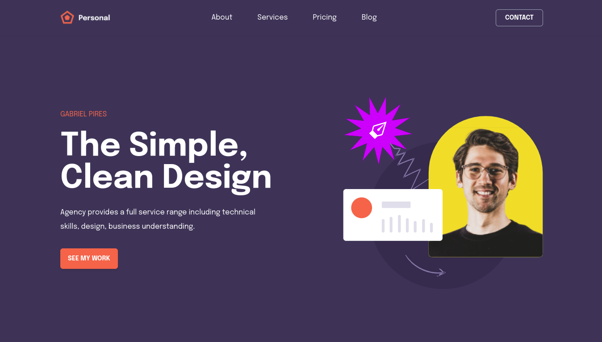

<h1 align="center">Personal</h1>

<div align="center">
   Personal is a webapp developed from `segsalerty mentorship` challenge.
</div>

<div align="center">
  <h3>
    <a href="https://personal.netlify.app/">
      Demo
    </a>
    <span> | </span>
    <a href="https://github.com/blade-01/segsalerty-mentorship/tree/personal">
      Code
    </a>
  </h3>
</div>

<!-- TABLE OF CONTENTS -->

## Table of Contents

- [Overview](#overview)
  - [Built With](#built-with)
  - [Useful resources](#useful-resources)
- [Features](#features)
- [How to use](#how-to-use)
- [Acknowledgements](#acknowledgements)
- [Contact](#contact)

<!-- OVERVIEW -->

## Overview



### Built With

- Semantic HTML5 markup
- SCSS custom properties
- Flexbox
- Mobile-first workflow
- [Vue.js](https://vuejs.org/)
- [Vue Router](https://router.vuejs.org/)

### Useful Resources

- [MDI Fonts](https://materialdesignicons.com/)
- [AOS - Animate On Scroll](https://michalsnik.github.io/aos/)
- [Tailwindcss](https://tailwindcss.com/)

## Features

Users should be able to:

- ✅ View the optimal layout for the app depending on their device's screen size
- ✅ See hover states for all interactive elements on the page

## How To Use

To clone and run this application, you'll need [Git](https://git-scm.com) and [Node.js](https://nodejs.org/en/download/) (which comes with [npm](http://npmjs.com)) installed on your computer. From your command line:

```bash
# Clone this repository
$ git clone git@github.com:blade-01/segsalerty-mentorship.git

# Switch branch
$ git checkout personal

# Change directory
$ cd personal

# Project setup
$ npm run serve

# Compiles and minifies for production
$ npm run build

# Lints and fixes files
$ npm run lint
```

## Acknowledgements

- I would like to thank `Segsalerty` for creating this opportunity for me to improve my frontend skills. Gracias 🤘

## Contact

- Website - [Animashaun Taofiq T.](https://www.github.com/blade-01)
- LinkedIn - [Animashaun Taofiq T.](https://www.linkedin.com/in/animashaun-taofiq/)
- Twitter - [@blade_vue](https://www.twitter.com/blade_vue)
